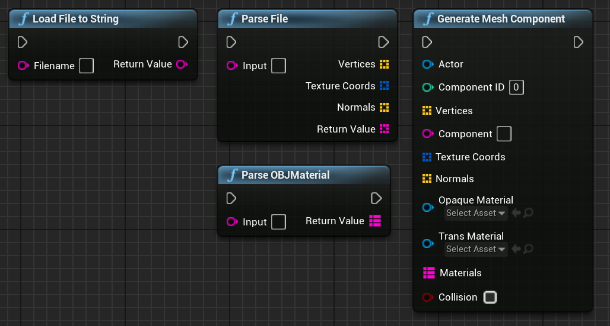

# CAD Runtime Importer

CAD Runtime Importer (CRI) is an Unreal Engine plug-in designed to help with importing models from files and generating them in runtime. Currently OBJ and STL files are supported. For materials with OBJ MTL files can be used. At its current state it supports Unreal Engine 4.23 and newer.

### Installation

* Download the release ZIP file
* Extract into your projects' plug-ins folder
* Build code once from your IDE
* Done!

### How To use

The functionality of the plug-in is offered through Blueprints. In order to use it, load a file, parse it and then use it to generate the components. The generating an Actor is needed to which the newly generated components can be attached to. It is advised that the mesh is split into groups and iterated through one bye one. Ideally call the Generate Mesh Function through a tick event while it's generated and turn it off afterwards. 

### CAD Runtime Presenter

CAD Runtime Presenter is a standalone, Unreal project that already implements the functionality needed for generating new files and interacting with them. There are two versions that can be found in the releases of this project, the desktop and VR versions. In order to use them, just download the zips, extract them and launch the executable. For VR currently Oculus Quest 1 and Quest 2 are supported.

#### Questions

For any further questions just contact me! Always glad to answer!